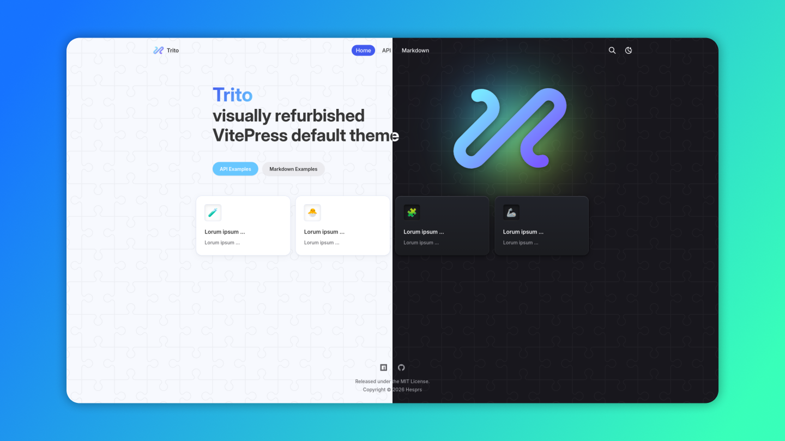
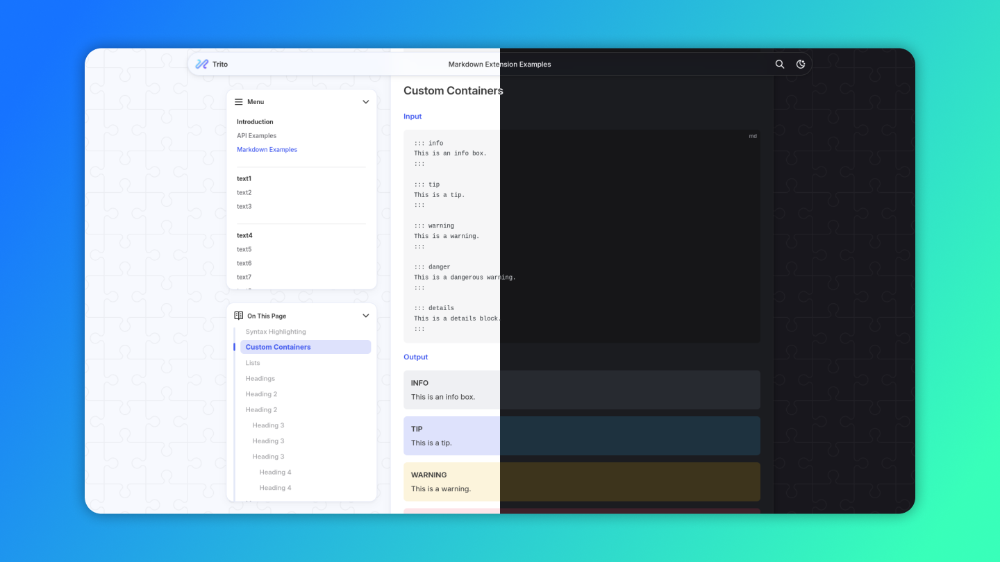

<h1 align="center">
    
    <br />
    Trito
    <br />
</h1>

<h4 align="center">Visually refurbished VitePress default theme</h4>

<p align="center">
    <a href="https://www.npmjs.com/package/json-canvas-viewer">
        
    </a>
    <a href="https://github.com/hesprs/json-canvas-viewer/actions">
        
    </a>
    
    
</p>





<p align="center">
    <a href="#🌐-sites-using-trito"><strong>Demos</strong></a> • 
    <a href="https://vitepress.dev/"><strong>About VitePress</strong></a>
</p>

## ❓ What is Trito?

Trito (pronounced as try-toe) is a [VitePress](https://vitepress.dev/) theme, which determines the look and feel of a VitePress generated site.

Trito titles itself as **"visually refurbished VitePress default theme"**, thus it does exactly **no more than** the functionalities achieved by the default theme. What makes it differs from the default one is pure UI/UX improvements.

Trito is designed to be a **drop-in replacement** to the default theme. If you want to make your site different from all other VitePress websites, please choose Trito 🌊. Don't forget to add a star ⭐!

## 🚀 How to use it?

Firstly install it using your favorite package manager, choose `devDependency` or not based on your use case, here we take `npm` as an example:

```sh
npm add vitepress-theme-trito
```

Then modify your `.vitepress/theme/index.ts` or `.vitepress/theme/index.js` to be like this:

```JavaScript
import Trito from 'vitepress-theme-trito';
export default Trito;
```

Go to `.vitepress/config.ts` or `.vitepress/config.js` and do the modifications below:

```TypeScript
// ... some other imports
import { ThemeConfig } from 'vitepress-theme-trito'; // specially for TypeScript
import { defineConfig } from 'vitepress';

export default defineConfig<ThemeConfig>({ // [specially for TypeScript] the type parameter makes VitePress aware of the theme
    // ... your config
    vite: {
        ssr: {
            noExternal: ['vitepress-theme-trito'], // this ensures the website can build
        },
    },
})
```

The extension of the theme is exactly the same as the default theme, refer to [how to extend the theme](https://vitepress.dev/guide/extending-default-theme) and [how to use the a custom theme](https://vitepress.dev/guide/custom-theme#consuming-a-custom-theme) in the official documentation for more detail.

## 🛠 Configuration

Trito keeps minimal intrusion to the default theme APIs.

If you want to stylize the styles, you can see all configurable CSS variables in [this file](https://github.com/hesprs/vitepress-theme-trito/blob/main/src/styles/vars.scss). For how to extend the styles, consult [this official page](https://vitepress.dev/guide/extending-default-theme#customizing-css).

The theme configuration is **almost identical** to the default theme's, which is documented well at the [reference page](https://vitepress.dev/reference/site-config). But some options do differ in nuances, see below:

### Frontmatters

#### Removed Home Page Option `hero.image`

- Replaced by [`logoLarge` theme config](#new-option-logolarge)

#### New Common Markdown Page (including `Home`) Option `unstyled: boolean`

- By setting it to `true`, pre-made styles will not be applied to the text content of the page.

### Theme Config

#### New Option `logoLarge`

- Type: [`ThemeableImage`](https://vitepress.dev/reference/default-theme-config#logo)
- It determines the hero image and the image in loading view, replacing `hero.image` in home frontmatter.

#### New Option `i18n`

- Adds or overrides translation strings.
- Type: Object, keys are locale codes (e.g., `en`, `de`, `zh-Hans`), values are objects of translations.
- See [this file](https://github.com/hesprs/vitepress-theme-trito/blob/main/src/composables/i18n.ts).

#### New Option `NotFoundLink`

- Configures the target of the return link shown in the 404 page.

#### Removed `outline.label`

- Handled by internal i18n utility.
- Now `outline` **directly configures the outline level**, refer to [official docs](https://vitepress.dev/reference/default-theme-config#outline).

#### Removed `editLink.text`

- Handled by internal i18n utility.
- Now `editLink` **directly configures the link pattern**, refer to [official docs](https://vitepress.dev/reference/default-theme-edit-link).

#### Removed `lastUpdated.text`

- Handled by internal i18n utility.
- Now `lastUpdated` **directly configures the date format**, refer to [official docs](https://vitepress.dev/reference/default-theme-last-updated).

#### Removed `carbonads`

- It downgrades UX and the UI has no room for it.

#### Removed `darkModeSwitchLabel`, `lightModeSwitchTitle`, `darkModeSwitchTitle`, `sidebarMenuLabel`, `returnToTopLabel`, `langMenuLabel`, `notFound`

- All handled by internal i18n utility.

## 🌐 Sites Using Trito

- [Pointeract documentation](https://pointeract.consensia.cc)
- [Hēsperus' portfolio](https://hesprs.github.io)
- ... Missing yours? Add here!

Disclaimer: `vitepress-theme-trito` is not related to, or effected by, the content of any of the sites above.

## 📝 Copyright & License

Copyright ©️ 2025-2026 Hesprs (Hēsperus) | [MIT License](https://mit-license.org/)
